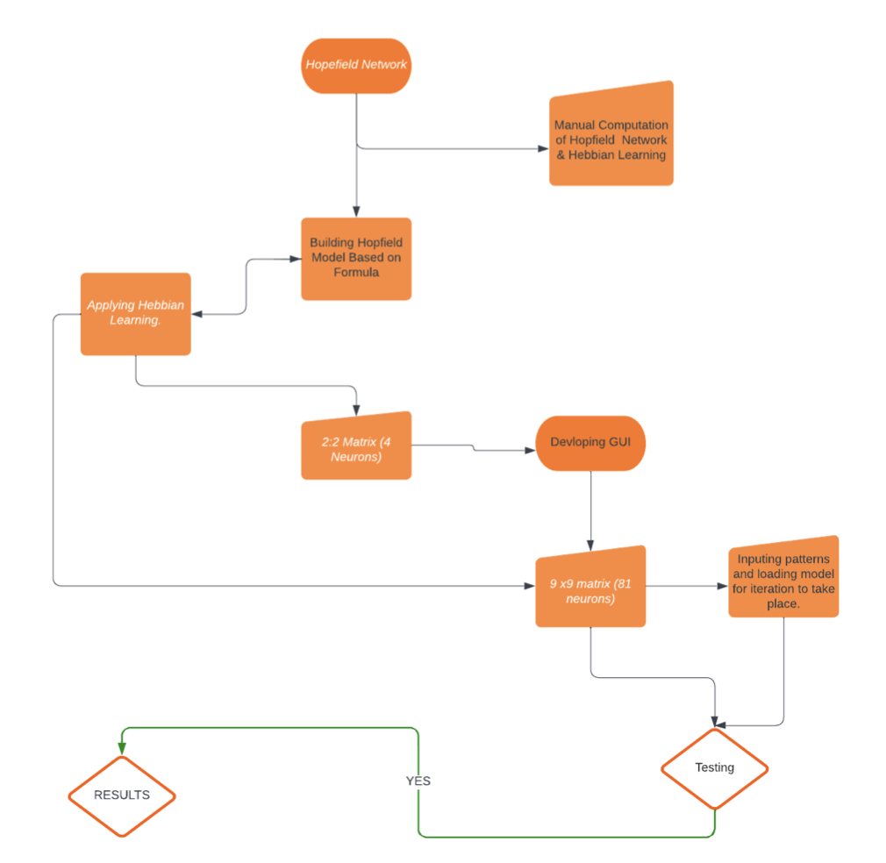
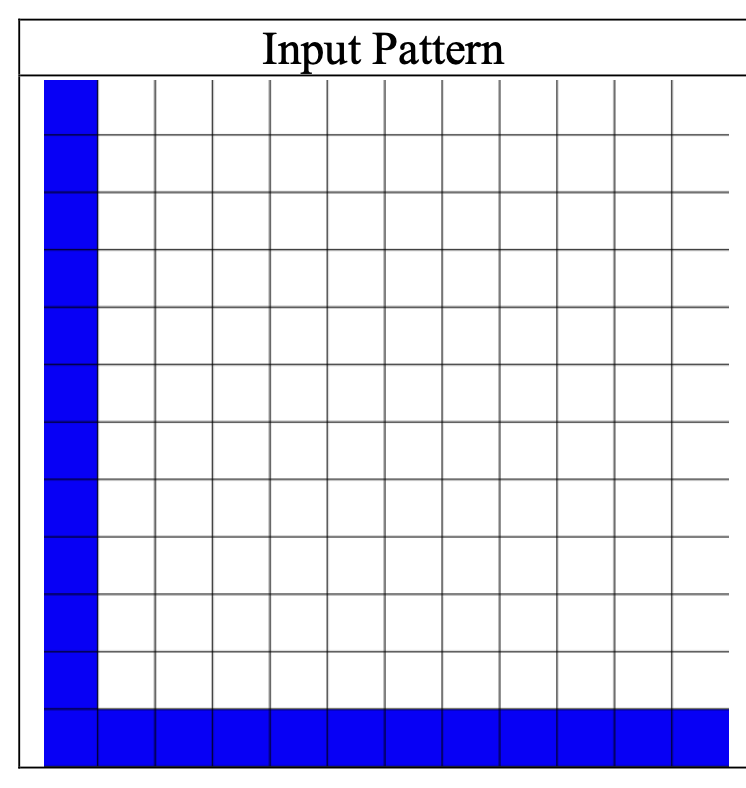
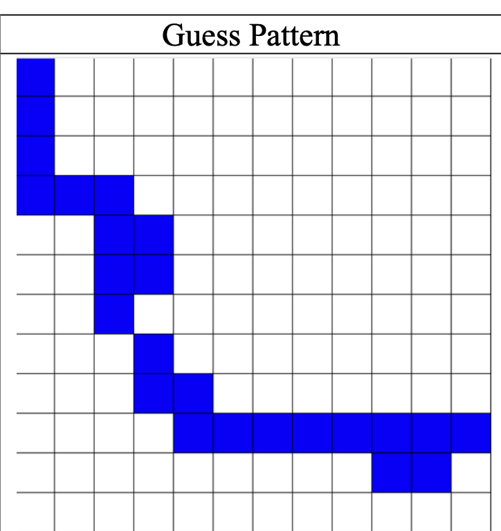
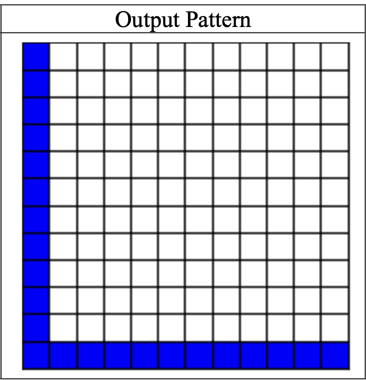

# Pattern Recognition Using Hopfield Neural Networks
## Overview

This repository presents a machine learning implementation of a Hopfield Neural Network (HNN) for pattern recognition and associative memory, developed for my MSc Data Science dissertation.

The project demonstrates how recurrent neural networks can learn, store, and recover binary patterns using the Hebbian Learning Rule, while highlighting important concepts such as energy minimisation, storage capacity, and spurious minima.

## System Workflow

The diagram below illustrates the overall workflow of the Hopfield Neural Network implementation used in this project.

  

## Results

### Graphical User Interface

### Pattern Recognition Example

### Experimental Results

## Project Objectives

  - Develop a Hopfield Neural Network for pattern recognition.
  - Implement Hebbian Learning for pattern storage.
  - Demonstrate associative memory through pattern recovery.
  - Evaluate the behaviour and limitations of Hopfield Networks.

## Academic Resources

This repository accompanies an MSc Data Science dissertation on Hopfield Neural Networks for pattern recognition.

- 📄 Dissertation: [`docs/hopfield_neural_network_dissertation.pdf`](docs/hopfield_neural_network_dissertation.pdf)
- 📊 Presentation: [`presentation/hopfield_neural_network_presentation.pptx`](presentation/hopfield_neural_network_presentation.pptx)

**Status:** Completed Research Project
